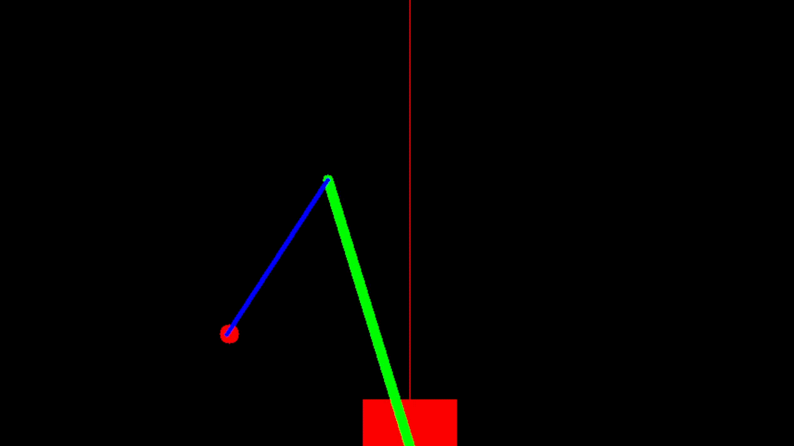

# 2DoF-Arm-Simulation
2DoF Arm Simulation with Inverse Kinematics. Using OpenCV changes state on mouse click.
Imagining a SCARA ARM moving in 2D

- Return possible value true if it is possible considering the length of the arm
- Returns the two angle (Arm1 angle, Arm2 angle)
- Left mouse click to assign the goal end point
- Adjustable ARM lengths
- Adjustable window length